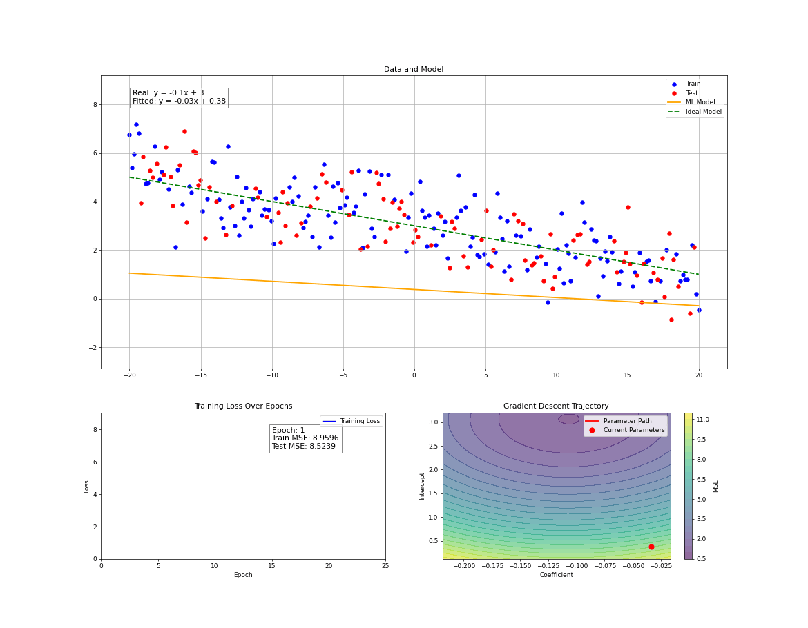
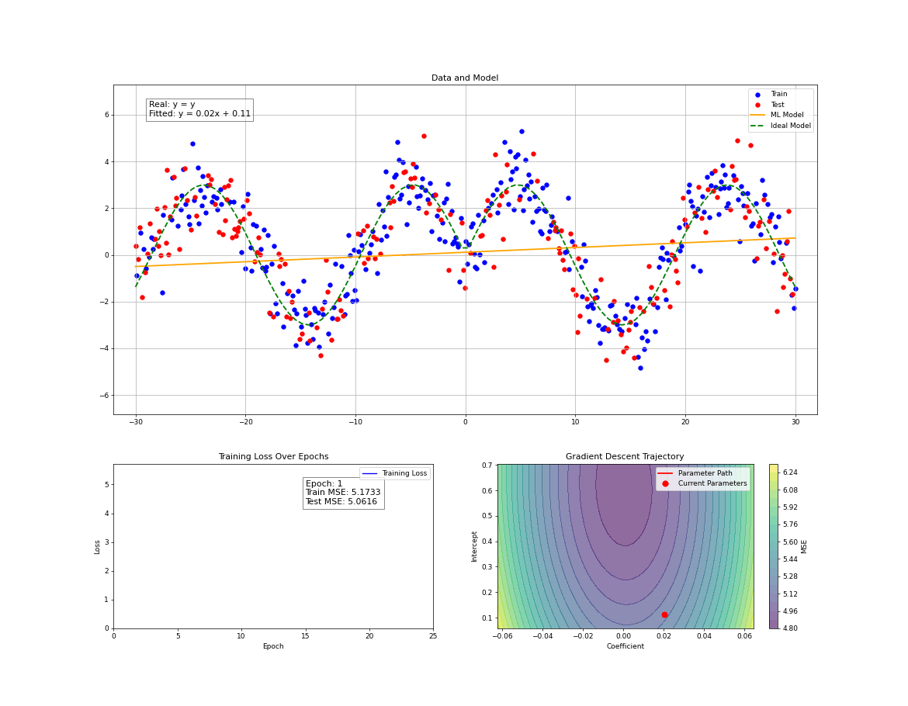
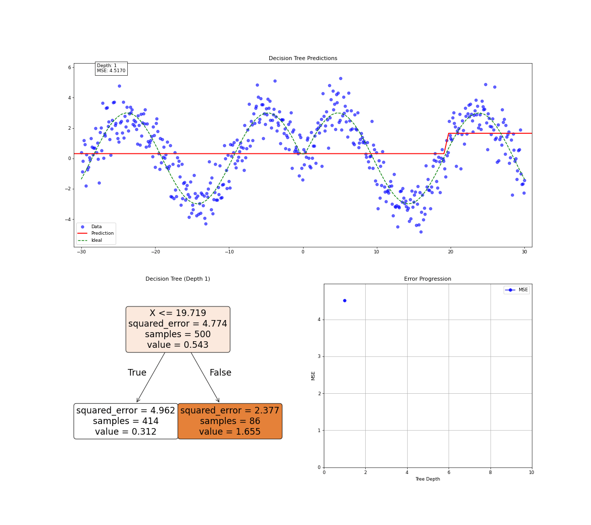
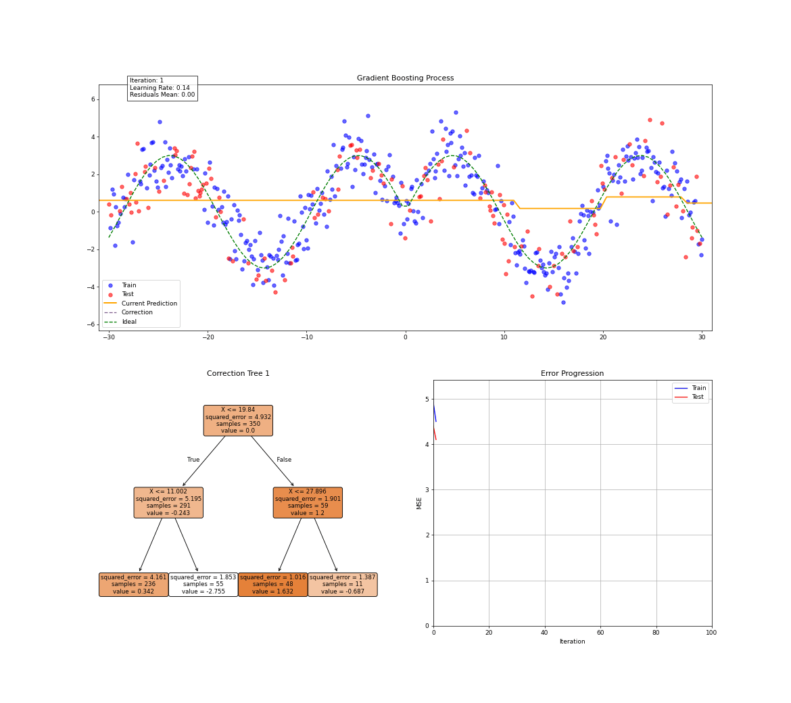

# Classic ML Learning Visualizing

Animated visualizations of the training process for various ML models. This project is created for educational purposes and to demonstrate the inner workings of machine learning algorithms.

## Features

- 🎥 Real-time training animation
- 📊 Visualization of loss function dynamics
- 🌳 Support for various models:
  - Random Forest
  - Gradient Boosting
  - Neural Networks

## Linear Regression

### Linear Data

### Non-linear Data

## Decision Tree

## Random Forest

## Gradient Boosting

## Neural Network

